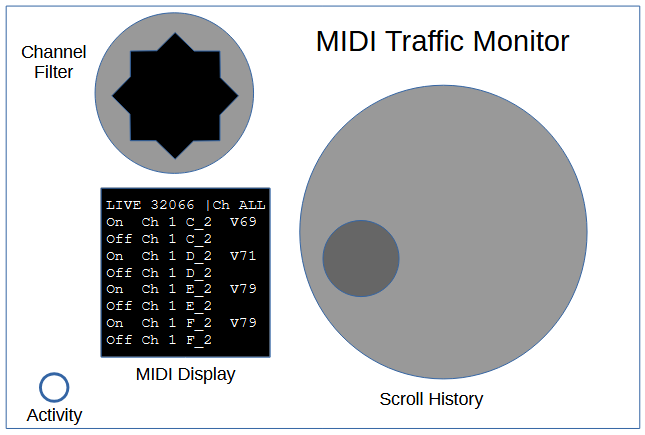
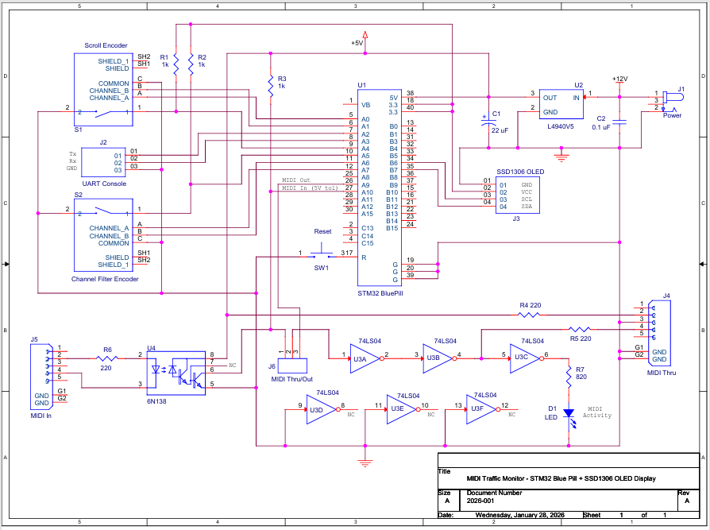
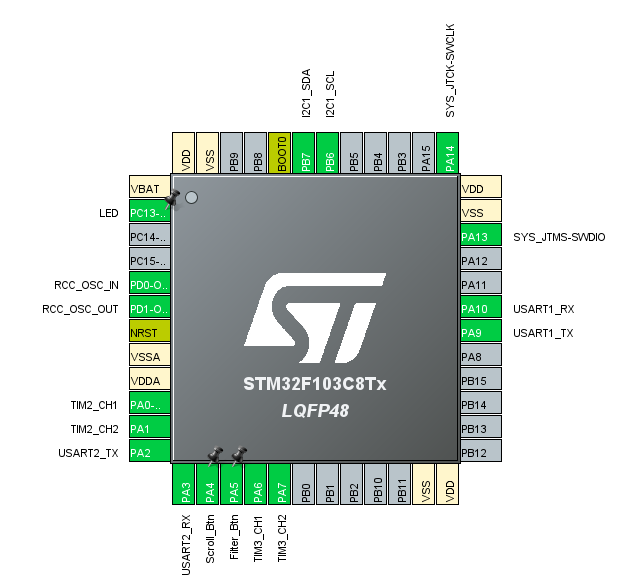
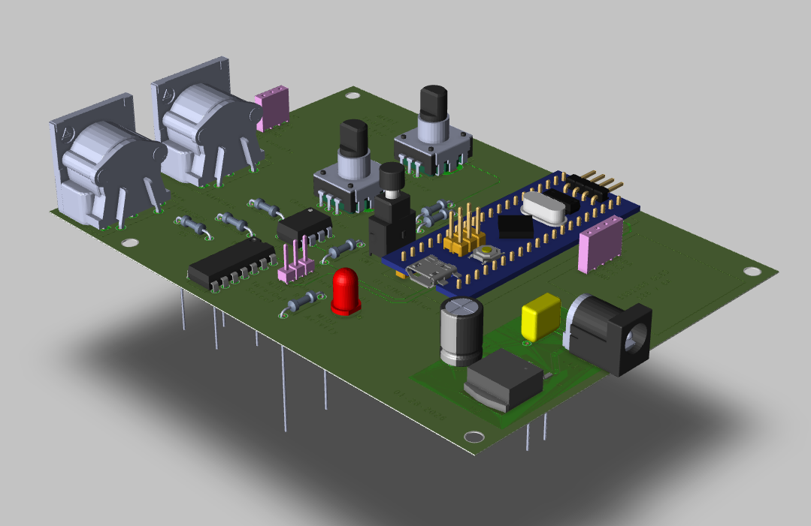

# MIDI Traffic Monitor

MIDI packet monitor for the STM32F103C8T6 "Blue Pill" with SSD1306 128x64 OLED display. Scrollable history maintained in SRAM. Interactive UI using rotary encoder scroll wheel, channel filter selector and pushbutton quick actions.

---

## Table of Contents - [Product Sketch / Mock-Up](#product-sketch--mock-up) - [Features](#features) - [Hardware Requirements](#hardware-requirements) - [Schematic](#schematic) - [STM32 Blue Pill Pinout Configuration](#stm32-blue-pill-pinout-configuration) - [3D PCB Render](#3d-pcb-render) - [Project Structure](#project-structure) - [Performance Summary](#performance-summary) - [Building and Flashing](#building-and-flashing) - [STM32F103 Setup (CubeMX)](#stm32f103-setup-cubemx) - [Hardware](#hardware) - [Firmware Architecture](#firmware-architecture)


# Product Sketch / Mock-Up



---

## Features

- **Live MIDI stream capture** via UART (31250 baud) with byte-arrival timestamping
- **Scroll wheel navigation** with short-press/long-press actions (jump to newest/oldest)
- **Active scroll bar animation** with position and rollover indication
- **History buffer** of 512 raw MIDI packets (stored in SRAM)
    - ~2 1/2 minutes of capture at 200 beats/minute (BPM)
- **Natural language parsing** of MIDI notes
- **OLED display output** using 128 x 64, .96" SSD1306 over I2C
- **Channel filter selector** with quick reset and session reinitialization support
- **Efficient ISR-driven UART FIFO** (2048 structures deep)
- **Console UART** for debug messaging and session monitoring
- **MIDI pass-through buffering** with activity LED

---

## Hardware Requirements

- STM32F103C8T6 ("Blue Pill")
- SSD1306 128x64 OLED (I2C)
- Rotary encoders with push buttons
- MIDI IN circuit (optocoupler + current limiting resistors)
- (Optional) MIDI pass-through buffering
- ST-Link v2 or compatible programmer/debugger

---

## Schematic



---

## STM32 Blue Pill Pinout Configuration




---

## 3D PCB Render




---

## Project Structure

```text
MIDI_Traffic_Monitor/
├── Core/                   # Source code and header files
├── Drivers/                # STM32Cube HAL/LL drivers
├── Debug/                  # Build output (ignored by Git)
├── hex_image/              # Prebuilt hex image for flashing STM32F103
├── hardware/               # Schematic (pdf), gerbers (zipped), 3D render
├── midi_monitor.ioc        # STM32CubeMX configuration
├── STM32F103C8TX_FLASH.ld
├── .gitignore
├── .project
├── .cproject
├── README.md
```

## Building and Flashing
1. Open the project in STM32CubeIDE.
2. Build the project (`Project > Build All`).
3. Flash to target using ST-Link (`Run > Debug As > STM32 Cortex-M C/C++ Application`).
4. Or flash the prebuilt image from `hex_image/` using STM32CubeProgrammer.

---
## Performance Summary
| **Capture/storage statistics (calculated/actual)**   |       |        |              |              |
| ------------------------------------------------------- | ----- | ------ | ------------ | ------------ |
|                                             |       |        |              |              |
| UART FIFO                                               | 2048  |        |              |              |
| MIDI History                                            | 512   |        |              |              |
|                                                         |       |        |              |              |
| Tempo (BPM)                                             | 600   | 300    | 200          | 150          |
| Tempo (msec)                                            | 100   | 200    | 300          | 400          |
| Beats/second                                            | 10    | 5      | 3.33         | 2.5          |
| Bytes/MIDI message                                      | 3     | 3      | 3            | 3            |
| Bytes/second                                            | 30.00 | 15.00  | 10.00        | 7.50         |
|                                                         |       |        |              |              |
| **Single note (1 MIDI, 3 bytes):**                      |       |        |              |              |
| UART FIFO fill time (no drain/calculated) – seconds                | 68.27 | 136.53 | 204.80       | 273.07       |
| UART FIFO fill time (with drain) – empirically measured | 90.00 | 270.00 | \>14 minutes | \>30 minutes |
| MIDI History (seconds)                                  | 51.20 | 102.40 | 153.60       | 204.80       |
|                                                         |       |        |              |              |
| **Chord Triad (3 MIDI, 9 bytes)**                       |       |        |              |              |
| UART FIFO fill time (no drain/calculated) – seconds                | 22.76 | 45.51  | 68.27        | 91.02        |
| UART FIFO fill time (with drain) – empirically measured | 28.00 | 60.00  | 102.00       | 150.00       |
| MIDI History (seconds)                                  | 17.07 | 34.13  | 51.20        | 68.27        |
|                                                         |       |        |              |              |
| **Chord Triad + note_off (6 MIDI, 18 bytes)**           |       |        |              |              |
| UART FIFO fill time (no drain/calculated) – seconds                | 11.38 | 22.76  | 34.13        | 45.51        |
| UART FIFO fill time (with drain) – empirically measured | 14.00 | 28.00  | 43.00        | 62.00        |
| MIDI History (seconds)                                  | 8.53  | 17.07  | 25.60        | 34.13        |


---

## STM32F103 Setup (CubeMX)

- STM32F103C8T6
    - Flash - 128k, SRAM - 20k
- STM32F103 configuration files generated from CubeMX:
    - USART1 - MIDI In (PA10), 31,250 baud
    - USART2 - Console UART (PA2/PA3), 115,200 baud
    - SSD1306 OLED I2C Display - SCL1/SDA1 (default PB6/PB7)
    - Scroll Wheel Rotary Encoder - TIM2_CH1/CH2 (PA0/PA1), Encoder Interface Mode (Quadrature Mode)
        - Combined Channels = Encoder Mode
        - Encoder Mode - TI1 and TI2
        - GPIO - Input with pull-up
        - Falling Edge, Input Filter ON (filter strength set to 4)
    - Scroll Wheel Pushbutton - GPIO PA4 (Input w/pull-up, EXTI mode, rising/falling edge)
    - Channel Filter Rotary Encoder - TIM3_CH1/CH2 (PA6/PA7), Encoder Interface Mode (Quadrature Mode)
        - Combined Channels = Encoder Mode
        - Encoder Mode - TI1 and TI2
        - GPIO - Input with pull-up
        - Falling Edge, Input Filter ON (filter strength set to 4)
    - Channel Filter Pushbutton - GPIO PA5 (Input w/pull-up, EXTI mode, rising/falling edge)
    - SWD Interface - PA13, PA14 (Blue Pill)
    - User LED (Blue Pill) - PC13
    - TIM4 - one-shot timer w/interrupt (~500ms) - controls display timing feature
        - One Pulse Mode
        - Prescaler = 64800 - 1, Counter Period = 500 - 1 (450 ms timeout)
    - RCC Crystal Oscillator (HSE - 8 MHz) - PD0/PD1 (default on STM32 Blue Pill)
    - Clock Configuration - HSE enabled (8 MHz), PLL 9x, SysClk = 72 MHz
    - SYSTICK Timer - default 1 ms
    - NVIC:
        - EXTI line4 interrupt enabled, priority 1
        - EXTI line[9:5] interrupts enabled, priority 1
        - TIM4 global interrupt enabled, priority 2
        - USART1 global interrupt enabled, priority 0

---
## Hardware

- SSD1306 OLED display:
    - 128x64 pixels, I2C interface w/on-board pullups
    - UI design ... status line at top, main screen holds 6 MIDI records
    - I2C delays plus display write functions result in sluggish display updates
        - For LIVE data capture, natural scrolling (i.e. newest on top, older below) impractical.
        - LIVE/incoming MIDI packets written to current line pointer, line pointer incremented to next line (i.e. newest record at bottom, older above)
        - 7th packet clears screen and starts again at top
	    - Not natural or appealing but better visual response (i.e. faster updates) during live activity
    - For scrolling ... natural scrolling order (newest at top, older below)
        - Scroll wheel movements recall one record at a time (1 detent = 1 record)
        - TIM4 timer triggered by scroll wheel movement and timeout expiration (~500 ms) initiates posting of remaining 5 records to display
            - Provides enough time to examine recalled record before remaining screen is painted. Avoids nuisance of waiting for screen refresh.
- MIDI In, MIDI Thru
    - 6N138 Opto Coupler
    - Output pulled up to +5V to support MIDI Thru
        - STM32F103 PA10 is 5V tolerant
    - 74LS04 Hex Inverter
        - Drives MIDI Thru connector and MIDI Activity LED
- Scroll Wheel Rotary Encoder
    - 2 counts/detent, 30 detents/revolution
        - "Smoother" feel for precise scrolling
    - TIM2 counter divided by 2 yields 1 increment (positive or negative) per detent
- Channel Filter Rotary Encoder
    - 4 counts/detent, 20 detents/revolution
        - "Purposeful" feel for channel selection
    - TIM3 counter divided by 4 in filter_setChannelFromEncoder() in filter_channels.c
        - Channel selection easily determined/calculated with modulo 17 (16 available MIDI channels)
- Encoder Pushbuttons
    - GPIO Input w/pull-up, EXTI mode, rising/falling edge
    - External pullups (1k) added to increase/improve button-release rise time
- Console UART
    - Standard/typical 115,200 console interface
    - __io_putchar() defined in main.c to support printf debugging
- Rev A - added hardware MIDI Thru/MIDI Out selection jumper to enable MIDI Out capability
    - Input to 74LS04 is jumper-selectable:
        - Route MIDI IN to MIDI Thru connector (for MIDI Thru functionality)
        - Route STM32 USART1 Tx to MIDI Thru connector (for MIDI Out functionality)
            - Note - MIDI Out requires separate (i.e. Sequencer) firmware

---

## Firmware Architecture

- No RTOS, simple SYSTICK-based task scheduler (1ms tick resolution)
    - Add `HAL_SYSTICK_IRQHandler();` to the `USER CODE BEGIN SysTick_IRQn 0` section of `void SysTick_Handler(void)` in `stm32f1xx_it.c`
        - This ensures `HAL_SYSTICK_Callback()` is called every 1ms
        - Note - `HAL_SYSTICK_IRQHandler()` is defined in `stm32f1xx_hal_cortex.c`
    - In `HAL_SYSTICK_Callback()` (in `main.c`), add:
        - `ms_counter++;` to track elapsed time
        - `run_scheduled_tasks();` to dispatch tasks at their scheduled intervals
    - Task setup is defined in `tasks.c`:
        - Use `scheduler_add_task()` in `tasks_init()` to register tasks
        - Define task callback functions (e.g., `heartbeat_task()`, `read_encoders_task()`, `poll_buttons_task()`)
    - In `main.c`, call `scheduler_init();` and `tasks_init();` before the `while(1)` loop
    - The scheduler is driven by `run_scheduled_tasks()` called from `HAL_SYSTICK_Callback()`
    - Currently, 3 tasks defined:
        - `heartbeat` – toggles LED for system heartbeat
        - `read_encoders` – reads rotary encoder state
        - `poll_buttons` – checks button inputs
    - **Troubleshooting Tip**: If tasks aren't running or the heartbeat LED doesn't blink, ensure `HAL_SYSTICK_IRQHandler();` is present in `SysTick_Handler()`. Without it, `HAL_SYSTICK_Callback()` won't be triggered.


- MIDI UART
    - Incoming bytes handled by ISR callback (HAL_UART_RxCpltCallback()) in main.c :
        - FIFO head/tail pointers managed in ISR callback
        - FIFO count incremented by "producer" (decremented by "consumer" in main loop)
    - Rx byte and arrival timestamp stored in rxFIFO
    - FIFO depth set to 2048 records (based on available SRAM and tradeoff with MIDI packet history)
        - `__attribute__`((packed)) used to condense FIFO structure
        - Structure holds uint8_t rxByte and 24-bit HAL timestamp
    - Circular buffer ... no rollover protection (newer arrivals overwrite older records) but deep enough to support MIDI History depth
    - Background/interrupt-driven processing of incoming bytes ensures no MIDI data is missed while updating display or scrolling history

- Console UART
    - `__io_putchar()` in main.c to support printf debugging:
        - int __io_putchar(int ch) {
    HAL_UART_Transmit(&huart2, (uint8_t *)&ch, 1, HAL_MAX_DELAY);
    return ch;
}

- Encoder Pushbutton Handlers
    - Interrupt based:
        - Rising and falling edge detection supports and identifies press and release events
    - Short/long press events and actions supported:
        - "Long" duration #defined in buttons.c :
            - LONG_PRESS_THRESHOLD_MS 500
        - Scroll pushbutton:
            - Short = return to LIVE (i.e. display newest record)
            - Long = jump to end (i.e. display oldest record)
        - Channel Filter pushbutton:
            - Short = reset channel selection to "ALL"
            - Long = end current capture session and initialize new session

- Simple main.c forevever loop:
    - Checks FIFO count for MIDI data arrival
        - Calls midi_build_packet(rx_data, rx_data_timestamp) in midi.c if new data is available
        - Decrements FIFO count (consumer of circular buffer)
    - Checks midi_isPacketAvailable flag
        - Calls ui_process_midi_packet() in ui.c if MIDI packet has been assembled and available
    - Checks timeoutFlag flag (from TIM4 timeout timer ISR)
        - Calls ui_fill_display() in ui.c if true

- tasks.c
    - Processes scheduler-dispatched periodic tasks
        - heartbeat() task - 500 ms
            - Routine activity ... flashes heartbeat LED
            - Animates "Waiting ..." message/screen at beginning of capture session
        - read_encoders() task - 20 ms
            - Reads TIM2/TIM3 counters, compares current to previous counts to detect movement
            - Scroll encoder movement detected ... calculates delta and calls ui_scroll_history(delta)
            - Channel Filter encoder movement detected ... sets filter channel and updates status line display
        - poll_buttons() task - 10 ms
            - Calls button_poll() in buttons.c
            - Processes button events decoded and posted in button_poll()
                - Note - button_exti_trigger(), called by HAL_GPIO_EXTI_Callback() in stm32f1xx_it.c, handles debounce and updates button states that are then used by button_poll() to determine actions
            - Switch statement gets button event from button_get_event() in buttons.c

- ui.c
    - Main user interface handler
    - Initializes UI and MIDI history array
    - Maintains capture session statistics (session start time, is_active flag, etc)
    - Processes MIDI packets
        - Posts packets to history array
        - Posts packets to display (if in LIVE mode)
    - Handles scroll functions and display updates
    - Applies channel filter setting in ui_get_filtered_record_index() to filter by user request
    - Processes TIM4 timeout with ui_fill_display() to fill rest of display screen
    - Handles ui_jump_to_oldest() when called from scroll button long press
    - Handles scroll bar calculation and display screen drawing:
        - Last 3 pixels of active screen reserved for scroll bar
            - Color inverts to indicate rollover (i.e. overwriting of previous history)
        - Last 2 pixels of Status Line reserved for background data arrival indication. Animated to indicate background MIDI activity while in scroll mode.
        - Two drawing modes for scroll bar:
            - Percent - dynamically adjusts scroll bar height to percent of reference (either total session count or maximum size of history if rollover has occurred)
            - Absolute - places scroll bar at requested position with requested height

- ssd1306.c
    - Library from https://github.com/afiskon/stm32-ssd1306/tree/master
    - Font - Font_6x8
    - 7 lines, 21 characters per line

- display.c
    - Display layout (7 usable lines):
        - Status Line - top line reserved for status and channel number
        - Main Screen - remaining 6 lines for incoming traffic and scrolling history
    - 2-state state machine
        - LIVE mode (for posting incoming MIDI data)
            - Display builds downward (newest at bottom) due to sluggishness of display scrolling
            - Status line indicates arrival timestamp (relative to capture session start)
        - SCROLL mode (for posting history)
            - Display writes newest at top, paints remainder downward
            - Status line indicates recalled record's index into history array and associated timestamp
    - Helper functions for SSD1306 display
        - display_clear_screen() - clears entire screen
        - display_clear_page() - clears main screen (scroll bar and status line unaffected)
        - display_string() - display string to main screen
        - display_status() - displays status message to status line
        - display_string_to_status_line() - display free-form string to status line
        - display_channel() - displays channel number to status line
        - display_draw_scroll_arrow() - displays scroll arrow
        - display_splash_screen() - just cosmetics, displays application statistics

- midi.c
    - Builds MIDI packets from raw byte UART capture:
        - midi_build_packet()
    - Parses MIDI packet for and builds MIDI message:
        - midi_process_message()
    - Skeleton for MIDI SysEx messages (but not implemented)
        - midi_handle_sysex()
    - Converts MIDI note number (0–127) to string like "C4"
        - midi_get_note_name()

- session.c
    - Manages capture session statistics and calculates session delta time
        - session_start()
        - session_stop()
        - session_isActive()
        - session_getStartTimestamp()
        - session_getDeltaTime()

- app_state_machine.c
    - Sets and gets application state
    - Enum defined in app_state_machine.h :
        - typedef enum {
    APP_STATE_MIDI_DISPLAY,
    APP_STATE_SCROLL_HISTORY,
	APP_STATE_CONFIG
} AppState;
