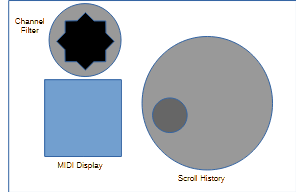
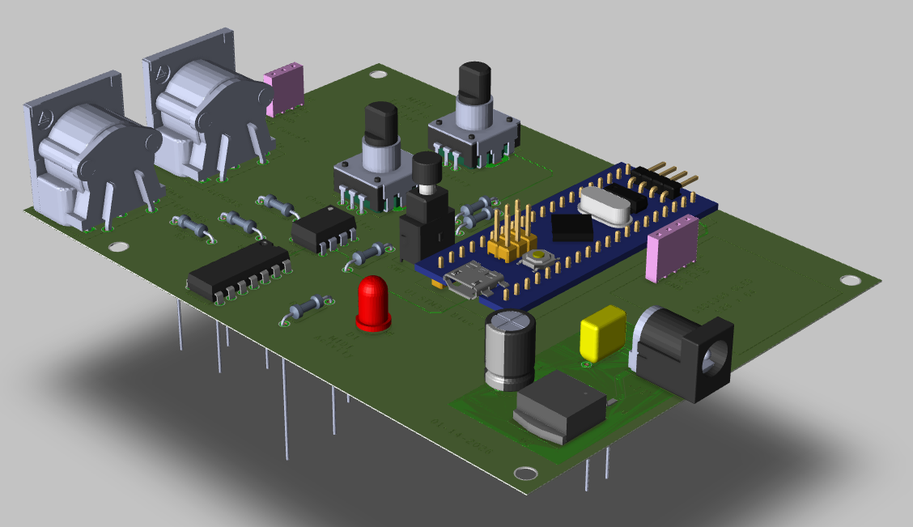

# MIDI Traffic Monitor

A real-time MIDI packet monitor and visualizer for the STM32F103C8T6 "Blue Pill" board with SSD1306 128x64 OLED display. Designed for efficient UART capture, scrollable history, and intuitive UI feedback using a rotary encoder.

---

# Product Look



---

## Features

- **Live MIDI stream capture** via UART (31250 baud)
- **Scroll wheel navigation** with short/long press actions
- **Animated scroll bar** with rollover indication and mode-aware behavior
- **History buffer** of up to 700 raw MIDI packets (stored in SRAM)
- **Real-time parsing** of MIDI notes and control messages
- **OLED display output** using 128 x 64, .96" SSD1306 over I2C
- **Channel filter** with reset and session reinitialization support
- **Efficient ISR-driven UART FIFO** (512 bytes deep)

---

## Hardware Requirements

- STM32F103C8T6 ("Blue Pill")
- SSD1306 128x64 OLED (I2C)
- Rotary encoder with push button
- MIDI IN circuit (optocoupler + current limiting resistors)
- ST-Link v2 or compatible debugger

---

## STM32 Blue Pill Pinout Configuration


---

## Schematic


---

## 3D PCB Render




---

## Project Structure

```text
MIDI_Traffic_Monitor/
├── Core/                   # STM32Cube-generated core files
├── Drivers/                # HAL/LL drivers
├── Debug/                  # Build output (ignored by Git)
├── hex_image/              # Prebuilt hex image for flashing STM32F103
├── hardware/               # Schematic (pdf), gerbers (zipped), 3D render
├── midi_monitor.ioc        # STM32CubeMX configuration
├── STM32F103C8TX_FLASH.ld
├── .gitignore
├── .project
├── .cproject
├── README.md
```

